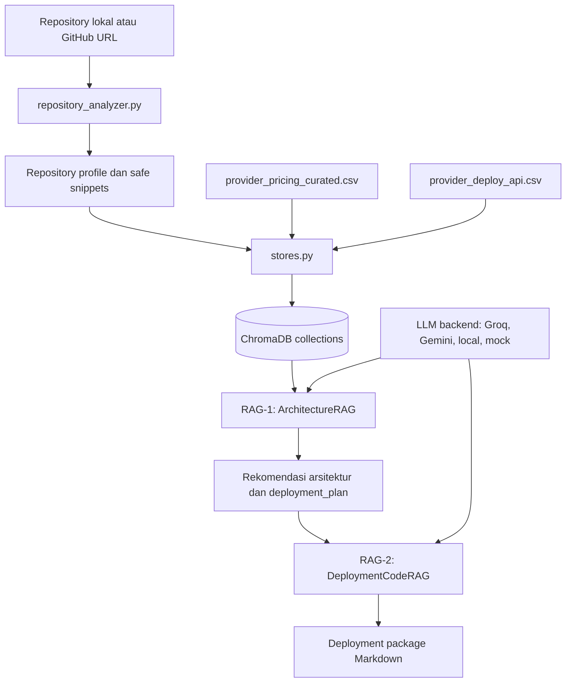

# DeployBuddy Intelligence

DeployBuddy Intelligence adalah prototipe sistem rekomendasi deployment berbasis RAG
(Retrieval-Augmented Generation). Proyek ini membantu memilih provider cloud yang
sesuai dengan tech stack, budget, target pengguna, dan region, lalu menghasilkan
draft script deployment berdasarkan API atau SDK provider tersebut.

Branch `try` berisi refactor versi sederhana dengan struktur file flat, dukungan
multi-backend LLM lewat `.env`, serta vector store ChromaDB untuk mengambil konteks
dari dataset pricing dan deployment provider.

## Fitur Utama

- Rekomendasi arsitektur deployment berdasarkan tech stack dan preferensi pengguna.
- Retrieval data pricing cloud dari `provider_pricing_curated.csv`.
- Retrieval informasi API deployment dari `provider_deploy_api.csv`.
- Dukungan backend LLM Groq, Google Gemini, dan local OpenAI-compatible endpoint
  seperti Ollama atau vLLM.
- Generator draft kode deployment Python lewat RAG-2.
- Guardrail anti-halusinasi untuk membedakan primary compute/hosting provider
  dari supporting service seperti database atau BaaS.
- CLI MVP tunggal untuk analisis repository, rekomendasi RAG-1, dan paket
  deployment RAG-2.

## Alur Sistem



## Struktur Repository

```text
.
|-- .env.example                 # Template konfigurasi LLM
|-- deploybuddy.py               # CLI MVP utama: analyzer -> RAG-1 -> RAG-2
|-- deploy_script_result.py      # Contoh hasil generate script deployment
|-- llm_client.py                # Abstraksi client LLM: Groq, Gemini, local OpenAI-compatible
|-- main.py                      # Contoh pipeline manual RAG-1 -> RAG-2
|-- provider_deploy_api.csv      # Dataset API/SDK deployment provider cloud
|-- provider_pricing_curated.csv # Dataset pricing provider cloud
|-- rag_1.py                     # RAG rekomendasi arsitektur dan deployment plan
|-- rag_2.py                     # RAG generator kode deployment
|-- repository_analyzer.py       # Deteksi stack, dependency, database, dan snippet repo user
|-- requirements.txt             # Dependency Python proyek
|-- stores.py                    # Loader CSV dan setup ChromaDB collection
|-- test.py                      # Contoh test pipeline dari repository GitHub
|-- test_github.py               # Varian test input GitHub URL
|-- test_local.py                # Varian test input direktori lokal
`-- test_pipeline.py             # Legacy/demo pipeline lama
```

## Dataset

Repository ini membawa dua dataset utama:

- `provider_pricing_curated.csv`: 650 baris data pricing provider cloud, region,
  SKU, resource, billing, dan sumber referensi.
- `provider_deploy_api.csv`: 16 baris metadata deployment API/SDK provider,
  termasuk metode autentikasi, secret yang dibutuhkan, flow deploy, dan rollback.

Saat `stores.py` di-import, kedua CSV dibaca dengan pandas, diubah menjadi dokumen
teks, lalu dimasukkan ke collection ChromaDB:

- `provider_pricing`
- `provider_deploy_api`

## Prasyarat

- Python 3.10 atau lebih baru.
- API key untuk salah satu backend LLM:
  - Groq, atau
  - Google Gemini, atau
  - Local OpenAI-compatible endpoint seperti Ollama.

Install dependency dari root repository:

```powershell
python -m pip install --upgrade pip
python -m pip install -r requirements.txt
```

## Konfigurasi Environment

Salin template environment:

```powershell
Copy-Item .env.example .env
```

Pilih salah satu backend di `.env`.

`LLM_PROVIDER` dan `LLM_BACKEND` sama-sama didukung. Gunakan salah satu saja agar
konfigurasi mudah dibaca.

Contoh Groq:

```env
LLM_PROVIDER=groq
GROQ_API_KEY=your_groq_api_key_here
GROQ_MODEL=llama-3.1-8b-instant
```

Contoh Google Gemini:

```env
LLM_PROVIDER=google
GOOGLE_API_KEY=your_google_api_key_here
GOOGLE_MODEL=gemini-1.5-flash
```

Contoh local Ollama atau endpoint OpenAI-compatible:

```env
LLM_PROVIDER=ollama
OLLAMA_BASE_URL=http://localhost:11434
OLLAMA_MODEL=llama3.1:8b
```

Untuk testing offline tanpa API key:

```powershell
$env:LLM_BACKEND="mock"
python deploybuddy.py --repo-path "." --budget 30 --ccu 200 --region "Indonesia" --output output
```

## Cara Menjalankan

Jalankan CLI MVP dari root repository:

```powershell
python deploybuddy.py --repo-path "." --budget 30 --ccu 200 --region "Indonesia" --output output
```

Untuk repository GitHub publik:

```powershell
python deploybuddy.py --repo-url "https://github.com/user/repo" --budget 30 --ccu 200 --region "Indonesia" --output output
```

Output disimpan ke folder `output/`:

- `repository_profile.json`: hasil deteksi stack, runtime, database, service type,
  snippet aman, warning file sensitif yang dilewati, dan nama env vars dari
  `.env.example`.
- `recommendation.json`: hasil RAG-1 yang sudah dinormalisasi dan divalidasi
  guardrail.
- `deployment_package.md`: draft Dockerfile, docker-compose, GitHub Actions,
  `.env.example`, guide, dan verify commands dari RAG-2.

`main.py` dan `test_pipeline.py` tetap tersedia sebagai script demo/legacy, tetapi
flow utama MVP sekarang memakai `deploybuddy.py`.

## Menjalankan Pipeline Analisis Repository

Beberapa file test disiapkan untuk membaca repository lokal atau GitHub sebelum
memberi rekomendasi deployment:

```powershell
python test_local.py --repo-path "C:\path\to\project" --budget 30
python test_github.py --repo-url "https://github.com/user/repo" --budget 30
python test_pipeline.py --repo-url "https://github.com/user/repo" --budget 30
```

Pipeline ini memakai `repository_analyzer.py` lokal untuk membaca manifest dan
source snippet penting tanpa mengambil file sensitif seperti `.env`, database lokal,
private key, atau isi `node_modules`.

Untuk test end-to-end offline yang stabil:

```powershell
$env:LLM_PROVIDER="mock"
python deploybuddy.py --repo-path "." --budget 30 --ccu 200 --region "Indonesia" --output output
```

## Cara Kerja RAG-1

`ArchitectureRAG` di `rag_1.py` menerima:

- `tech_stack`: bahasa, framework, database, tipe service, dan konteks tambahan.
- `user_prefs`: budget, target CCU, target region, dan service type.

Kelas ini membuat query dari input tersebut, mengambil konteks pricing dan deploy
dari ChromaDB, lalu meminta LLM menghasilkan JSON dengan struktur:

- `architecture_diagram`
- `detected_repository_profile`
- `provider`
- `provider_category`
- `service_model`
- `region`
- `resource_spec`
- `estimated_monthly_cost_usd`
- `provider_comparison_matrix`
- `supporting_services`
- `guide`
- `deployment_plan`
- `risk_notes`

Sebelum output dikembalikan, RAG-1 memvalidasi provider utama terhadap tipe
workload. Untuk backend/API/worker, provider kategori `database` seperti Supabase,
Neon, Firebase, dan MongoDB tidak boleh menjadi `provider` utama. Provider tersebut
hanya boleh masuk ke `supporting_services`, misalnya sebagai database, auth, atau
storage.

## Cara Kerja RAG-2

`DeploymentCodeRAG` di `rag_2.py` menerima `deployment_plan` dan `provider` dari
RAG-1. Sistem mengambil konteks deployment provider dari ChromaDB, lalu meminta LLM
menghasilkan paket draft deployment yang bisa berisi `Dockerfile`,
`docker-compose.yml`, GitHub Actions workflow, `.env.example`, provider-specific
guide, dan script API/SDK bila data provider cukup.

RAG-2 mengambil dokumentasi deployment dengan exact provider match jika metadata
ChromaDB tersedia. Jika detail API/SDK tidak ada di konteks, prompt meminta LLM
menulis `TODO` daripada mengarang endpoint, SDK method, atau secret.

Script yang dihasilkan perlu dianggap sebagai draft. Review manual tetap wajib
dilakukan sebelum script dipakai ke akun cloud sungguhan.

## Catatan Branch `try`

- Branch aktif saat dokumentasi ini dibuat adalah `try`.
- Branch ini memakai struktur flat di root, bukan folder `rag/` seperti versi
  sebelumnya.
- `chroma_db/` dan `__pycache__/` saat ini ikut terlacak di Git. Untuk repo yang
  lebih bersih, biasanya keduanya dimasukkan ke `.gitignore` dan ChromaDB dibangun
  ulang saat setup.
- `stores.py` mengisi collection ChromaDB setiap kali di-import. Jika ChromaDB sudah
  berisi ID yang sama, versi Chroma tertentu dapat memunculkan error duplicate ID.
  Solusi yang lebih stabil adalah memakai pengecekan collection count, `upsert`,
  atau reset `chroma_db/` sebelum membangun ulang index.

## Roadmap Pengembangan

- Tambahkan mode CLI opsional seperti architecture-only, package-only, dan validate-only.
- Pisahkan generated file seperti `deploy_script_result.py` dari source utama.
- Tambahkan test otomatis untuk parsing JSON output RAG-1 dan cleaning kode RAG-2.
- Validasi script deployment sebelum dieksekusi ke provider cloud.

## Handoff Lanjutan

Untuk developer manusia atau AI agent yang akan melanjutkan integrasi website,
API backend, atau auto-deploy, baca panduan lengkap di
[`docs/DEVELOPER_HANDOFF.md`](docs/DEVELOPER_HANDOFF.md).
